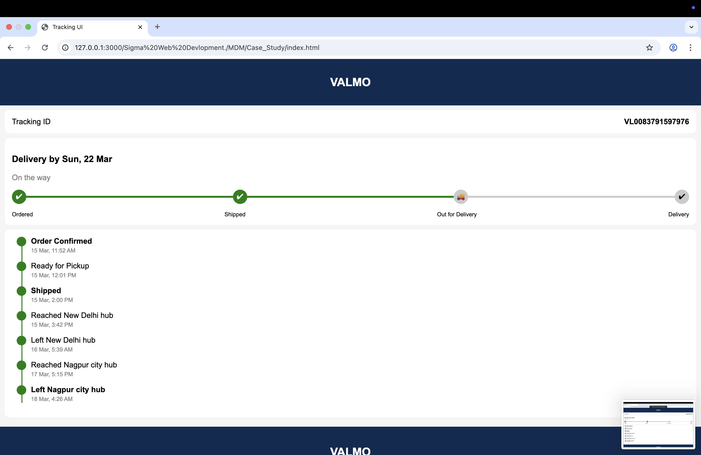

📦 Tracking System UI – Case Study (Web Development)

📌 Project Overview

This project is a Tracking System User Interface developed as part of a Web Development case study. It demonstrates how modern e-commerce platforms (like Flipkart, Amazon, etc.) track and display the real-time status of an order.

The system visually represents the journey of a product from order confirmation to final delivery.

---

🎯 Objective

The main objective of this project is to understand:

- How tracking systems work in real-world applications
- How to design a user-friendly tracking interface
- How front-end technologies are used to display dynamic data

---

⚙️ Features

- 📍 Display of Tracking ID
- 🚚 Delivery date estimation
- 📊 Progress bar showing order stages:
  - Ordered
  - Shipped
  - Out for Delivery
  - Delivered
- 🕒 Timeline of tracking updates
- ✅ Clean and simple UI design

---

🛠️ Technologies Used

- HTML5
- CSS3
- (Optional) JavaScript for dynamic behavior

---

🧠 How It Works (Concept)

1. Each order is assigned a unique Tracking ID
2. The backend system updates order status at different stages
3. The frontend UI fetches and displays:
   - Current status
   - Delivery progress
   - Timeline updates
4. A progress bar visually shows how far the delivery has reached

---

📸 Screenshot

Example:

---

🚀 How to Run This Project

1. Download or clone the repository
2. Open the project folder
3. Run the "index.html" file in your browser

---

📚 Learning Outcome

- Learned about real-world tracking system architecture
- Improved front-end design skills
- Understood user experience (UX) in delivery tracking systems

---

🔮 Future Improvements

- Add real-time data using APIs
- Integrate backend (Node.js / Firebase)
- Add map tracking feature (like live location)

---

👩‍💻 Author

- Khushi Fasate (206)

---

⭐ If you like this project, give it a star on GitHub!
